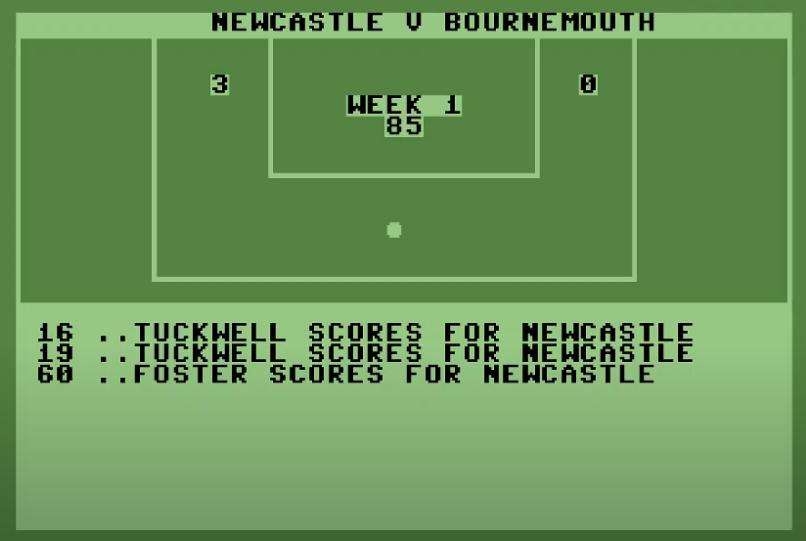

# footballmanager

A simple Python football manager game inspired by The Boss on C64:
https://www.lemon64.com/game/boss

The game emulates a Premier League-style season with 20 clubs, generated
squads, weekly fixtures, match simulation, tactics, transfers, finances, player
stats, injuries, and a live text match screen for the team you manage.



## Features

- 20 Premier League-style clubs with generated squads of 20 players each.
- Player attributes for position, rating, age, value, and injury status.
- Randomly generated 38-week fixture list saved to `fixture_list.json`.
- League table with played, wins, draws, losses, goals for, goals against, goal
  difference, and points.
- Team menu for viewing the squad and selecting a starting XI.
- Formation-based tactics: 4-4-2, 4-3-3, 4-2-4, 5-4-1, 4-5-1, and 5-3-2.
- Match simulation driven by team ratings, home advantage, player positions,
  and player ratings.
- Live minute-by-minute match screen for your team's fixture.
- Goal scorer tracking and club streak stats.
- Transfer market for buying, selling, and loaning players.
- Delayed weekly transfer processing, including AI club transfer actions.
- Finances menu with bank balance, sponsorship deals, and bank loans.
- Stadium data for each club, with helper logic for attendance and ticket
  revenue.
- Injury tracking with replacement prompts when selected players become
  unavailable.

## Requirements

- Python 3.10 or newer
- `colorama`

Install the dependency with:

```bash
python -m pip install colorama
```

## How to Run

From the project folder:

```bash
python main.py
```

When the game starts, choose a club to manage. The game then creates fresh
squads and a new fixture list for the season.

## Main Menu

```text
1. Team
2. Tactics
3. Fixtures
4. Transfer Market
5. Play Game
6. Table
7. Simulate Season
8. Stats
9. Finances
10. Injured Players
0. Exit
```

## Gameplay Notes

- Use `Team -> Select Team` before playing your first match.
- Changing formation clears your current starting XI, so you need to select a
  new lineup that fits the formation.
- AI teams auto-select their strongest available team each week.
- Forwards are most likely to score, followed by midfielders, defenders, and
  goalkeepers, with ratings influencing the chance.
- Transfers and loans are submitted during the week and processed after the
  gameweek.
- Players sold or loaned out are removed from the selling club's squad and
  starting XI.
- Injured players are unavailable until their injury timer expires.

## Project Layout

```text
main.py                 Main menu and game loop
team_management.py      Team creation, squads, selections, finances, stadiums
fixtures.py             Season fixture generation and fixture lookup
game_simulation.py      Match engine, live match screen, injuries, weekly flow
transfer_market.py      Buy, sell, loan, AI actions, delayed transfers
tactics.py              Formations and tactic menu
table.py                League table model and display
stats.py                Goal scorers and club streak stats
player.py               Player generation and value calculation
Teams/                  Generated team squad JSON files
playernames.csv         Source names for generated players
banks.txt               Bank names used by the loan menu
sponsors.txt            Sponsor names used by sponsorship offers
commentatorgoals.txt    Commentary lines for goals
```

## Development Status

This is an early hobby project and still has plenty of room to grow. The broad
roadmap includes deeper match events, assists, player development, scouting,
contracts, staff, media, stadium management, promotions and relegations,
European competitions, save files, and historical seasons.

## Thanks

Started in Aider, continued in Cline, and then continued further in Cursor AI.
